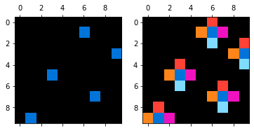
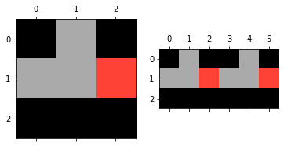
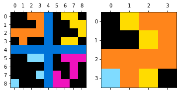

This repository contains my solution of the [Abstraction and Reasoning Challenge](https://www.kaggle.com/c/abstraction-and-reasoning-challenge) on Kaggle, where my team took 3rd place. It is only my part of our final solution. Using it alone with blend with some public kernels, one could get a position somewhere in the higher silver. This approach also solves 138 and 96 samples from the train and valid sets, respectively. You can find the lists of solved cases in `solved.json`.
`demo_notebook.ipynb` demonstrates how to make predictions using my code.

You can also look into [Kaggle Notebook](https://www.kaggle.com/ilialar/5-tasks-part-of-3rd-place-solution) solving 5 test tasks with my solution.

Even though the competition itself is very original, I hope the ideas I used can help someone in other applied tasks.

# 0. Disclaimer
This competition required a lot of tries and errors, and any time I choose between simple, high-quality production-level code and fast iteration, I decided latter. So the code itself is not optimal and unclear sometimes. But in this particular case, I think that ideas are more important than code itself.

# 1. Introduction
The task of the competition was "to create an AI that can solve reasoning tasks it has never seen before." You can see a couple of examples of these tasks below.

##### Example 1

**Train:**


**Test:**


##### Example 2

**Train:**


**Test:**


This competition is highly specific and not similar to any other DS competitions I have participated in. This particular repository and the description below are addressed to those who participated in the competition or at least familiar with the task. I recommend you to read the information [on the official Kaggle page](https://www.kaggle.com/c/abstraction-and-reasoning-challenge), [github repository](https://github.com/fchollet/ARC) and / or [the original article about abstraction and reasoning](https://arxiv.org/abs/1911.01547)


# 2. My approach

In general, my method can be described as a domain-specific language (DSL) based. I have created the abstract representation of the colors, image blocks extracted from the original input image, and different binary masks. Using these abstractions, I wrote several "predictors" that try to derive a set of transformations used to get every output image from the corresponding input image and, if it succeeds – apply these transformations to test input to get the final answer.

## 2.1 Abstractions
Each abstract representation of color, block, or mask is a JSON-like object that describes a set of transformations used to get this object from the original image. Below are several examples.

### 2.1.1 Colors
I use a few ways to represent colors; below are some of them:

- Absolute values. Each color is described as a number from 0 to 9.
Representation: `{"type”: "abs”, "k”: 0}`

- The numerical order of color in the list of all colors presented in the input image sorted (ascending or descending) by the number of pixels with these colors.
Representation: `{"type”: "min”, "k”: 0}`, `{"type”: "max”, "k”: 0}`

- The color of the grid if there is one on the input image.
Representation: `{"type”: "grid_color”}`

- The unique color in one of the image parts (top, bottom, left, or right part; corners, and so on).
Representation: `{"type": "unique", "side": "right"}`, `{"type": "unique", "side": "tl"}`, `{"type": "unique", "side": "any"}`

- No background color for cases where every input has only two colors and 0 is one of them for every image.
Representation: `{"type": "non_zero"}`

Etc.


### 2.1.2 Blocks
Block is a 10-color image somehow derived from the input image. Each block is represented as a list of dicts; each dict describes some transformation of an image. One should apply all these transformations to the input image in the order they are presented in the list to get the block. Below are some examples.

#### The first order blocks (generated directly from the original image):

- The image itself.
Representation: `[{"type": "original"}]`

- One of the halves of the original image.
Representation: `[{"type": "half", "side": "t"}]`, `[{"type": "half", "side": "b"}]`, `[{"type": "half", "side": "long1"}]`

- The largest connected block excluding the background.
Representation: `[{"type": "max_block", "full": 0}]`

- The smallest possible rectangle that covers all pixels of a particular color.
Representation: `[{"type": "color_max", "color": color_dict}]`
color_dict – means here can be any abstract representation of color, described in 2.1.1.


- Grid cell.
Representation: `[{"type": "grid", "grid_size": [4,4],"cell": [3, 1],"frame": True}]`


- The pixel with particular coordinates.
Representation: `[{"type": "pixel", "i": 1, "j": 4}]`


Etc.


#### The second-order blocks – generated by applying some additional transformations to the other blocks:


- Rotation.
Representation: `[source_block ,{"type": "rotation", "k": 2}]`
`source_block` _means that there can be one or several dictionaries, used to generate some source block from the original input image, then the rotation is applied to this source block_


- Transposing.
Representation: `[source_block ,{"type": "transpose"}]`


- Edge cutting.
Representation: `[source_block ,{"type": "cut_edge", "l": 0, "r": 1, "t": 1, "b": 0}]`
_In this example, we cut off 1 pixel from the left and one pixel from the top of the image._


- Resizing image with some scale factor.
Representation: `[source_block , {"type": "resize", "scale": 2}]`, `[source_block , {"type": "resize", "scale": 1/3}]`


- Resizing image to some fixed shape.
Representation: `[source_block , {"type": "resize_to", "size_x": 3, "size_y": 3}]`


- Swapping some colors.
Representation: `[source_block , {"type": "color_swap", "color_1": color_dict_1, "color_2": color_dict_2}]`


Etc.

- There is also one special type of blocks - `[{"type": "target", "k": I}]`. It is used when for the solving ot the task we need to use the block not presented on any of the input images but presented on all target images in the train examples. Please, find the example below.

**Train:**




**Test:**


### 2.1.3. Masks

Masks are binary images somehow derived from original images. Each mask is represented as a nested dict.

- Initial mask literally: `block == color`.
Representation: `{"operation": "none", "params": {"block": bloc_list,"color": color_dict}}`
bloc_list here is a list of transforms used to get the block for the mask generation


- Logical operations over different masks
Representation: `{"operation": "not", "params": mask_dict}, {"operation": "and", "params": {"mask1": mask_dict 1, "mask2": mask_dict 2}}, {"operation": "or", "params": {"mask1": mask_dict 1, "mask2": mask_dict 2}}, {"operation": "xor", "params": {"mask1": mask_dict 1, "mask2": mask_dict 2}}`

- Mask with the original image's size, representing the smallest possible rectangle covering all pixels of a particular color.
Representation: `{"operation": "coverage", "params": {"color": color_dict}}`


- Mask with the original image's size, representing the largest or smallest connected block excluding the background.
Representation: {"operation": "max_block"}


You can find more information about existing abstractions and the code to generate them in `preprocessing.py`.


## 2.2 Predictors

I have created 32 different classes to solve different types of abstract task using the abstractions described earlier. All of them inherit from `Predictor` class.

The general logic of every predictor is described in the pseudo-code below (although, it can be different for some classes).

```
for n, (input_image, output_image) in enumerate(sample[‘train’]):
    list_of_solutions = []
    for possible_solution in all_possible_solutions:
        if apply_solution(input_image, possible_solution) == output_image:
            list_of_solutions.append(possible_solution)
    if n == 0:
        final_list_of_solutions = list_of_solutions
    else:
        final_list_of_solutions = intersection(list_of_solutions, final_list_of_solutions)

    if len(final_list_of_solutions) == 0
        return None

answers = []
for test_input_image in sample[‘test’]:
    answers.append([])
    for solution in final_list_of_solutions:
        answers[-1].append(apply_solution(test_input_image, solution))

return answers
```

The examples of some predictors and the results are below.


- **Puzzle** - generates the output image by concatenating blocks generated from the input image.

**Train:**




**Test:**


- **MaskToBlock** - applies from 1 to 3 binary masks to some block.

**Train:**





**Test:**


- **Fill** – applies different 3x3 masks for pixels of images. Either check some condition in this mask and then fill the central pixel or check the condition of the central pixel and fills everything else using the mask.

**Train:**


**Test:**


- **ReconstructMosaic** – reconstructs the mosaic-like pictures with some covered parts

**Train:**


**Test:**


- **ReplaceColumn** – replaces some columns of the input image to fixed columns of output.

**Train:**


**Test:**


- **ConnectDots** – connects dots of particular color.

**Train:**


**Test:**


- **GravityBlock** – moves some blocks toward some gravity source

**Train:**


**Test:**


- **Pattern** – replaces every `True` pixel of the mask with some block.

**Train:**


**Test:**


Etc.


# 3. Kind of decorators or callbacks

I have also implemented some functionality, helping my predictors to solve a broader range of tasks. The way I applied them does not strictly qualify as decorators or callbacks but have similar ideas behind them.

## 3.1 Skip some train samples
If you pass to any predictor `{"skip_train": n}`, it will skip n input-output train pairs. It helps in a couple of cases:
- One of the train samples has a mistake in it.
- Train samples can be divided into 2+ categories, the predictor can solve the task only for one of them, and you are lucky, and the test is also from this group.

## 3.2 Rotate, Reflect, Roll
Sometimes it is useful to rotate, reflect, and/or roll the input and / or output image for your predictor to solve the case.

## 3.3 Eliminate Background
In some cases, there are parts of the image that contain relatively simple tasks that can be solved by existing predictors. `elim_background` option helps to work with these cases. Example below.

**Train:**


**Test:**


# 4. Optimization

Each time you add any additional abstraction, the number of possible variants, computational time and memory used growth very fast. To work with it, I used some tricks.

## 4.1 Caching
Usually, you can extract one block from the image with a lot of different ways. And there is no need to store all of them as well as there is no need to compute many times.

I store all the information about blocks in the following format:

```
{
    "arrays”: {
        array1_hash: {
             "array”: numpy array representing the block
             "params”: the list of all possible ways to generate this array
    },
        array2_hash: {
             "array”: numpy array representing the block
             "params”: the list of all possible ways to generate this array
        },
        …
    "params”:{
        params1_hash: corresponding_array_hash,
        params2_hash: corresponding_array_hash,
        ….	
    }
} 
```

Whenever I generate a new array, I compute its hash and check, whether I already calculated, if so, I just append the new params to the corresponding list, and add params hash to the `params` dict with the link to the array.

If I have a JSON-like object with parameters some abstract rule for block generation, first of all, I check whether the hash of this JSON is in "params" dict and if so, don't compute it but just take from the `arrays` dict.

The same logic is applied to masks.


## 4.2 Filtering
A high level of abstraction leads to situations when one transformation can be described in many different ways, and all of them will be equivalent and correct. It is ok, but it increases the computational complexity. That is why I do filtering.
The simplest example is about colors: let's imaging that all test and train images have four colors each, that means that `{"type": "min", "k": 0}` and `{"type": "max", "k": 3}` will always represent the same color for each image (but can represent different colors for different). This means that we can safely delete one of these options form all samples.
More generally, if two abstract representation of some object results in the same object for every image (train and test), we can ignore one of them. 
This logic applies to all types of objects: colors, blocks, and masks.


## 4.3 Multiprocessing
Fast iterations are essential in this competition. That is why I have used multiprocessing wherever it is possible. I have used 24 threads locally for experiments and all 4 threads in kernels for faster submissions.

Another useful thing in multiprocessing – you can control the amount of RAM and computational time for every process and safely kill it if needed.

You can check the way I have done it in `submission_utils.py`.

 

# 5. Other useful ideas

## 5.1 Testing
This is the first Kaggle competition where I have covered almost everything I have done with unit tests.

I have often faced the situation when I improve core logic to solve some complex problems and later find out that some simple ones don't work anymore. After that, I have decided that I will add a unit test for most of the new tasks I have solved. Finally, I have 100+ tests in `test_predictots.py` that help me control that nothing is broken. I use the `pytest` library for it.


# 6. Final words
I have tried to describe everything I have done as clearly as possible, but I understand that the logic and code are not straightforward, so feel free to ask any questions.

I hope you have found any useful thoughts and ideas in my solution. 


### Citation

```
@misc{abstraction-and-reasoning-challenge-solution,
    author = {Ilia Larchenko},
    title = {Abstraction and Reasoning Challenge Solution},
    year = {2020},
    publisher = {GitHub},
    journal = {Github repository},
    howpublished = {\url{https://github.com/IliaLarchenko/abstract_reasoning}}
}
```
